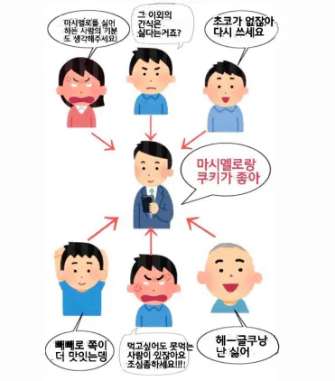
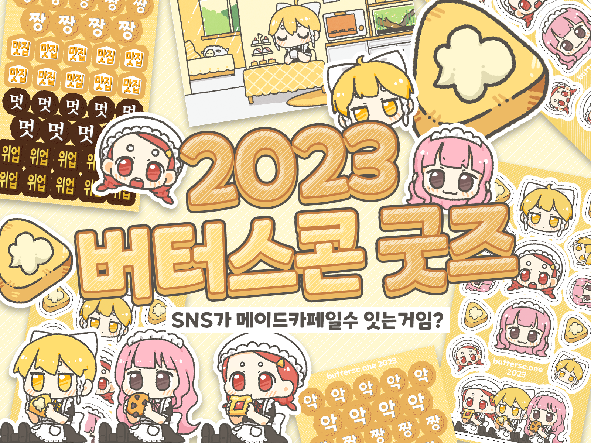

# 2023 버터스콘 연말 회고

안녕하세요? 버터스콘의 운영 및 모더레이터를 겸직하고 있는 잼입니다.

뭔가 여기저기서 하는 분위기인 것 같아서 서버 운영에 대한 회고록을 적어보려 합니다. 아무쪼록 읽으시는 분들께 연합우주 운영 및 이용에 대해 참고가 되거나 잼얘가 되거나 하셨으면 좋겠습니다.

# 버터스콘만의 풍미

**“어디든 비슷하니 아무 서버나 가도 괜찮다” 라는 것은 분산형 SNS 시스템의 특색을 살리지 못하는 것이라 생각했습니다.** 

서버가 망할 경우의 리스크는 커지겠지만… 여러 성향과 지향점을 가진 서버들이 자유롭게 소통할 수 있다는 점이 연합우주의 매력이라고 생각합니다.

버터스콘은 타 서버와 확연한 차별점이 많기 때문에 모두를 위한 서버는 아닌 것 같지만, 찾아오신 분들께서는 만족하며 이용하고 계시면 좋겠습니다. 버터스콘에서 밀고 있는 차별점들에 대한 이야기를 하겠습니다.

## 마스코트 및 커스텀 이모지

마스코트 캐릭터를 내세우면 운영 주체를 완전히 타자화할 수 있다는 장점이 있습니다. 모에화, 우상화라기보다 일종의 부캐 개념으로 쓰고 있습니다.

쿠키 모양 커스텀 이모지, 아바타 데코레이션 등은 버터스콘만의 무드를 살리고자 열심히 추가하고 있습니다. 타 서버에서의 수입을 자제해주셨으면 하고 있는데 아직까지는 대부분 배려해주시고 계신 것 같습니다. 이 자리를 빌려 감사드립니다. 

## 규칙

연합우주에서는 알티스타가 되지 않아도 벌어질 수 있는 일입니다

로컬/글로벌 타임라인은 **게시 즉시 불특정 다수에게 내용이 노출되는 공간**입니다. 공개된 공간의 특성상 위의 이미지와 같은 상황이 발생하기 쉽다고 생각하여, 이를 최대한 방지하려 합니다. 따라서 **불특정 다수에게 보여지는 공개 게시물에는 CW를 잘 걸자!** 라는 규칙은 계속 유지할 것 같습니다.

최근까지는 해당 규칙이 있는 유일 서버였으나, NSR 릴레이의 등장으로 규칙이 호환되는 서버가 늘어나는 것이 보입니다. 피로도 낮은 SNS에 대한 수요는 확실히 있는 것 같아요.

### ‘CW가 필요한 글’의 기준

피로감을 주는 글이란 무엇일까요? 아무리 노력해도 주관이 들어갈 수밖에 없는 부분이라 생각합니다만 (버터스콘에서는) 기본적으로 **‘관련인 또는 생판 타인에게 부정적 감정이 들거나 플로우가 형성될 만한 글’** 이라고 생각해주시면 될 것 같습니다. 

버터스콘에서는 현실에서 일어나고 있는 각종 차별과 부당함에 대한 글이나, 특정 그룹에 대한 부정적인 일반화로 읽힐 수 있는 글, 끔찍한 범죄에 관한 글, 나라가 곧 망할 것 같다는 기분이 들게 하는 글 등 다양한 게시물을 모더레이션해왔습니다. 

따로 신고가 들어오지 않아도 능동적으로 관리하고 있습니다만, 추후에 연합우주의 규모가 더 커지면 키워드 필터만 사용하거나 글로벌 타임라인을 메우거나 하게 되지 않을까요…(확정된 것 없음)

### 게시물의 제재

버터스콘에는 독자 모더레이션 기능인 ‘게시글 공개 범위 변경’이 탑재되어 있습니다. 

덕분에 리모트 게시물을 삭제하는 대신 ‘홈 공개’ 이하의 범위로 공개범위를 변경하여, 검색/안테나/홈 타임라인에서는 문제 없이 열람이 가능하게 되었습니다. 

공개 타임라인(로컬/글로벌)에만 노출되지 않을 뿐, **필요에 의한 열람에 제한을 두지 않고 있는 점** 거듭 알려드립니다. 

## 버터스콘 유저의 성향

버터스콘은 기본적으로 초대제로 운영되고 있기 때문에, 대부분의 유저분들께서는 홈 타임라인에서만 활동하고 계시는 것 같습니다.

최근 모더레이션 리소스의 부족으로 대형 릴레이에서 일시적으로 탈퇴하기도 했는데, 이에 대해서도 딱히 피드백이 없으신 것으로 보아… 홈탐에서 즐거운 시간을 보내고 계신 것으로 보입니다.

이런 성향 탓인지 서버의 규모(평균 20~30명 접속 중)에 비해 로컬 타임라인은 상대적으로 조용한 편입니다. 가끔씩 안부 인사 나눠요! 

## 버터스콘의 독자 기능 자랑

:kami:

버터스콘에서는 기술 담당이신 쇼콜라 님께서 이런저런 차력쇼를 하시고 계십니다. 따라서 타 미스키 서버에는 없는 기능도 있고, UX가 조금 다르기도 합니다.  

버터스콘만의 독자 기능을 자랑하겠습니다.

- **(모더레이션) 게시글 공개 범위 변경**
→ 이 기능이 없었다면 버터스콘의 모더레이션은 지금쯤… …
- **(모더레이션) 서버 사일런스** 
→ 순정 미스키에도 추가되었습니다만 버터스콘에서 선제적으로 도입된 기능입니다.
- **노트 수정 및 수정된 리모트 게시물의 연합**
- **노트 영역을 아무 데나 눌러서 자세히 보기** 
→ 게시 시간이나 더 보기 버튼을 찾기 어려워하시는 분들이 많아 트위터like의 UX가 되었습니다.
- **노트 자세히 보기 페이지에서 자동으로 답글 펼치기**
→ ‘답글 보기’ 버튼을 누를 필요가 없습니다.
- **계정 청소 (노트 청소기)**
→ 노트 3,000개 가량을 삭제하는 데에 1분 남짓 걸리는 것을 확인했습니다.
    
    
    
- **타임라인의 리노트 표시/비표시 상태 기억하기**
→ 탐라 역주행 등을 수월히 하기 위해 일시적으로 적용하는 기능입니다만, 해당 설정을 유지할 수 있게 되었습니다.
    
    
    

# 2023 버터스콘 굿즈 판매

1주년 겸 서버 운영비용을 마련할 겸 겸사겸사 굿즈 판매를 진행하게 되었습니다. 관심 가져주시고 구매해 주신 여러분께 다시 한 번 감사드립니다. 문제가 터지지 않는다면 다음 주 내로 수령하실 수 있으실 것 같아요.

사실 평범하게 후원을 받는 쪽이 서버 운영비용 마련에는 좀더 수월할 것이라 생각합니다. 그렇지만 역시 아무런 추가 특혜도 제공해드리지 않는데 돈을 받는다는 것은 빚을 진다는 느낌이 들어서… 

사실 수익보다는 거의 재미 목적으로 진행하고 있으니 (하기했지만 돈이 궁한 상황은 아닙니다) 매년 이맘때쯤 크리스마스 씰마냥 소소하게 진행되면 좋을 것 같습니다. 

**굿즈 수익금으로는 쇼콜라 님을 위한 스콘지원금(스콘 50개 정도의 분량)과 서버 운영비용이 마련되었습니다.** 앞으로도 잘 부탁드립니다.

# 버터스콘의 현재 재정 상황

버터스콘의 서버 운영에는 그리 큰 돈이 들어가지는 않습니다. 일반적인 월간 구독 서비스 정도의 금액이라 생각해주시면 되겠습니다. 갑자기 유저가 엄청나게 늘어나거나 하지 않는 이상 재정에 위기가 생길 일은 없을 것 같습니다. 

# 2024년의 버터스콘

일단은 지금의 지향점을 유지하며 별 일 없이 운영될 수 있다면 좋을 것 같습니다. 

컨텐츠적으로는 단순한 튜토리얼부터 시작해서 한국 연합우주에 유입이 늘어날 만한 프로젝트를 하고 싶은데 아직은 생각만 하고 있어요. 안 할 수도 있습니다.

# 끝맺음

버터스콘은 작년 11월 24일, 1인 서버로 시작해 어느 새 600명이 넘는 유저가 이용하는 서버가 되었습니다.

버터스콘의 설립과 유지, 운영에 도움 주신 모든 분들, 버터스콘을 포함한 연합우주에서 활동하고 계신 분들, 그리고 버터스콘과 연합하고 있는 157개의 연합우주 서버에 감사 인사를 드립니다. 내년에도 잘 부탁드려요.

이 글을 읽고 버터스콘에 흥미가 생기셨다면 주변인에게 초대 코드를 요청해보세요. (운영자에게 요청해도 됩니다)